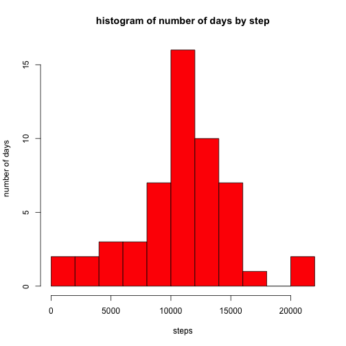
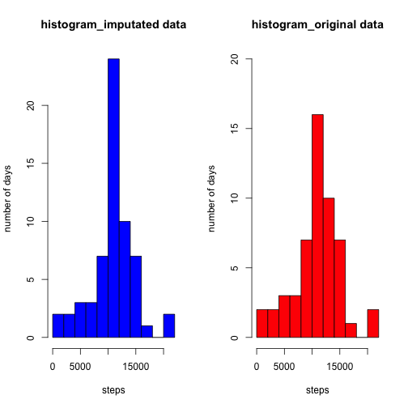

R Markdown for Peer Assessment 1 
================================
  
  
##Loading and preprocessing the data
load dplyr for manipulating data frame
read data from file and transfer steps to numeric type

```r
library(dplyr)
library(RCurl)
data<-read.csv("activity.csv",colClasses="character")
data$steps<-as.numeric(data$steps)
data$interval<-as.numeric(data$interval)
```

filter out steps which is na


```r
data2<-filter(data,!is.na(steps))
data2$date<-as.factor(data2$date)
```
split data according to date
give new numeric vector of steps by day

```r
stepbyday<-tapply(data2$steps,data2$date,sum,simplify=T)
```

## What is mean total number of steps taken per day?
we can see the mean and median calculated down below:

```r
mean(stepbyday)
```

```
## [1] 10766
```

```r
median(stepbyday)
```

```
## [1] 10765
```
histogram of steps by day is drawn here:

```r
hist(stepbyday,col="red",breaks = 10,xlab="steps",ylab="number of days",main = NA)
title("histogram of number of days by step")
```

 

## What is the average daily activity pattern?

split the data using interval as factor,
we draw a time-series steps taken on a basis of 5-minute interval


```r
stepbyinterval<-tapply(data2$steps,data2$interval,mean,simplify=T)
plot(stepbyinterval,type="l",xlab="time interval",ylab="steps",main=NA)
title("average steps of time interval of the day")
```

 
  
  
  
  
we find the interval which has most averaged step. (find the index then put into interval column)

```r
data2$interval[[which.max(stepbyinterval)]]
```

```
## [1] 835
```

# Imputing missing values

first we calculate the total na's found in the dataset
(actually is simple enough to be length difference of data and data2)

```r
stepisna<-is.na(data$steps)
sum(stepisna)
```

```
## [1] 2304
```

then create a new data set and fill in the na's  
**Strategy**:
I imputate with mean of all days of that time interval because all the missing values seems all-or-none by day.  
Simply loop over column of steps, find the corresponding index in the vector and fill data in if encouter na's.   

create a new dataset named "data_imputated" and fill the data in

```r
data_imputated<-clone(data)

for (i in 1:length(data_imputated$steps))
{
    if (is.na(data_imputated$steps[i]))
        {
        index=(((data_imputated$interval[i])%/%100)*12 + ((data_imputated$interval[i]%%100)/5)+1)
        data_imputated$steps[i]<-stepbyinterval[index]
        }
}
```

Make a histogram of the total number of steps taken each day after imputation.
if we compare it with the previous plot we can see the difference.


```r
stepbyday_imputated<-tapply(data_imputated$steps,data_imputated$date,sum,simplify=T)
stepbyinterval_imputated<-tapply(data_imputated$steps,data_imputated$interval,mean,simplify=T)
par(mfrow =c(1,2))
hist(stepbyday_imputated,col="blue",breaks = 10,xlab="steps",ylab="number of days",main=NA)
title("histogram_imputated data")
hist(stepbyday,col="red",breaks = 10,ylim=c(0,20),xlab="steps",ylab="number of days",main = NA)
title("histogram_original data")
```

 
  
  
  
  
Calculate and report the mean and median total number of steps taken per day.  
We can see that the mean didn't change, but median moved toward mean.


```r
mean(stepbyday_imputated)
```

```
## [1] 10766
```

```r
median(stepbyday_imputated)
```

```
## [1] 10766
```


## Are there differences in activity patterns between weekdays and weekends?
  
Using imputated data and add new variable of is.weekend to data (is.weekend=TRUE if it is Saturday or Sunday)  
for plotting, generate vector of average steps at interval of both groups

For comparing strings, I need to set to local language setting to English to get the correct result  
(My computer is under environment of traditional Chinese.)


```r
Sys.setlocale(category = "LC_ALL",locale="en_US.UTF-8")
```

```
## [1] "en_US.UTF-8/en_US.UTF-8/en_US.UTF-8/C/en_US.UTF-8/zh_TW.UTF-8"
```

```r
is.weekend<-sapply(data_imputated$date,FUN=function(x) (weekdays(strptime(x,format="%Y-%m-%d"))=="Saturday")||(weekdays(strptime(x,format="%Y-%m-%d"))=="Sunday"))
data_last<-cbind(data_imputated,is.weekend)
weekday_group<-filter(data_last,is.weekend==TRUE)
weekend_group<-filter(data_last,is.weekend==FALSE)
weekend_average<-tapply(weekend_group$steps,weekend_group$interval,mean,simplify=T)
weekday_average<-tapply(weekday_group$steps,weekday_group$interval,mean,simplify=T)
```

At last! we make a panel plot comparing these two groups

```r
par(mfrow=c(2,1), mar=c(2,4,2,4),oma=c(4,2,4,2),cex = 0.5,xpd=NA)
plot(weekend_average,type="l",ylab=NA,xlab=NA,ylim = c(0,250),xlim=c(0,300))
legend("topright",legend = "weekend")
plot(weekday_average,type="l",ylab=NA,xlab=NA,ylim = c(0,250),xlim=c(0,300))
legend("topright",legend = "weekday")
text(150,-50,labels="interval",cex=2)
mtext(side = 2,"steps",line=3)
```

 

## We are done here! Thank you for your time!
